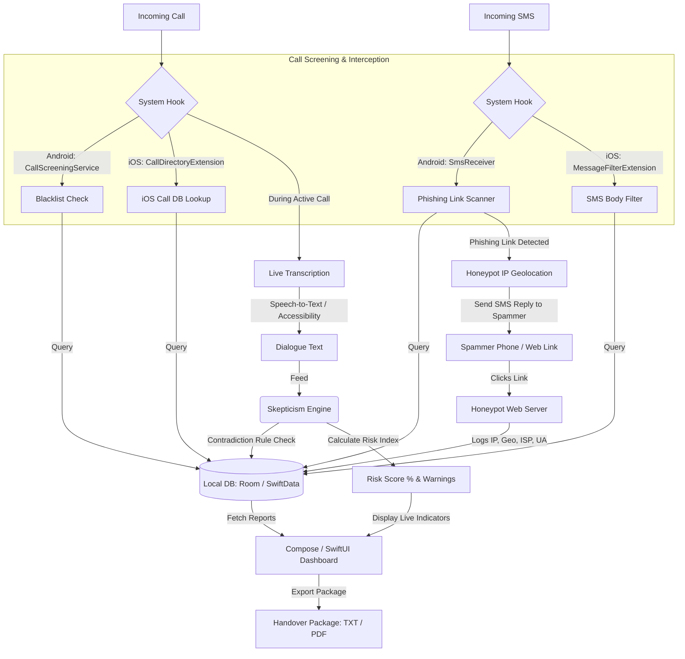

# SpamCall Architecture and System Design

SpamCall (防騙衛士) provides deep system-level integration on both Android and iOS to detect, intercept, and analyze scam attempts. This document details the high-level architecture, data flows, and honeypot design.

---

## 🏗️ High-Level System Architecture

The following diagram illustrates how incoming communications are intercepted, analyzed by the **Skepticism Engine**, and logged for police handovers.



---

## 🔒 Communication Interception Mechanisms

### 1. Call Interception
* **Android**: Uses `CallScreeningService` (API 29+). When a call arrives, the system triggers `onScreenCall`. The app queries the local Room database. If the caller's number is present in `scam_numbers`, the app instructs the system to reject the call, skip the notification, but record it in the call log.
* **iOS**: Uses a `CallDirectoryExtension`. Because iOS runs extensions in sandboxed processes without direct database access, the main application pre-compiles the blacklist data into a flat array of numbers and writes it into the extension group. The iOS system handles the actual blocking/identification using this compiled store.

### 2. SMS Interception & Phishing Link Blocking
* **Android**: Uses a `BroadcastReceiver` listening for `android.provider.Telephony.SMS_RECEIVED`. It extracts text content and scans for URLs. If a URL is found, it intercepts routing and marks the incident as a high-risk event.
* **iOS**: Uses a `MessageFilterExtension` which acts as an interceptor. It analyzes incoming text and reports to the system whether to filter the message into the "Junk" folder or flag it.

---

## 🎯 Honeypot IP Geolocation Mechanism

When a phishing SMS containing a link is intercepted by the system, SpamCall automatically initiates an active defense mechanism (the Honeypot):

```
                       ┌────────────────┐
                       │ Spammer Device │
                       └───────┬────────┘
                               │ Sends Phishing SMS
                               ▼
                    ┌──────────────────────┐
                    │ Android SpamCall App │
                    └───────┬──────────────┘
                            │ Intercepts Link, inserts into DB
                            │ Sends Honeypot Reply SMS
                            ▼
                       ┌────────────────┐
                       │ Spammer Device │
                       └───────┬────────┘
                               │ Clicks Consent Link (e.g., guardcall.link/consent-XYZ)
                               ▼
                    ┌──────────────────────┐
                    │ Honeypot Web Server  │
                    └───────┬──────────────┘
                            │ Queries GPS via browser / logs IP & User-Agent
                            ▼
                    ┌──────────────────────┐
                    │ Local Incident Log   │
                    └──────────────────────┘
```

1. **Auto-Reply**: The app automatically crafts a reply SMS containing a custom honeypot link (e.g., `https://guardcall.link/consent-{reportId}`) and sends it back to the spammer.
2. **Social Engineering**: The reply text mimics a standard compliance message: *"Please review and accept our security tracking policy first to continue transfer authorization: [Link]"*.
3. **Tracking Capture**: When the spammer clicks the link, the webpage asks for location authorization. If agreed, it reports detailed GPS coordinates. Even without location permission, the server logs:
   * **IPv4/IPv6 Address**
   * **ISP Carrier** (e.g., HKT, China Mobile, SmarTone)
   * **Geographic Geocode** (Sham Shui Po, Mong Kok, etc.)
   * **Device User-Agent** (operating system, browser type)
4. **Data Sync**: The captured details are written back to the local `call_incident_reports` table via a local broadcast/API sync, linking it directly to the caller's number.
